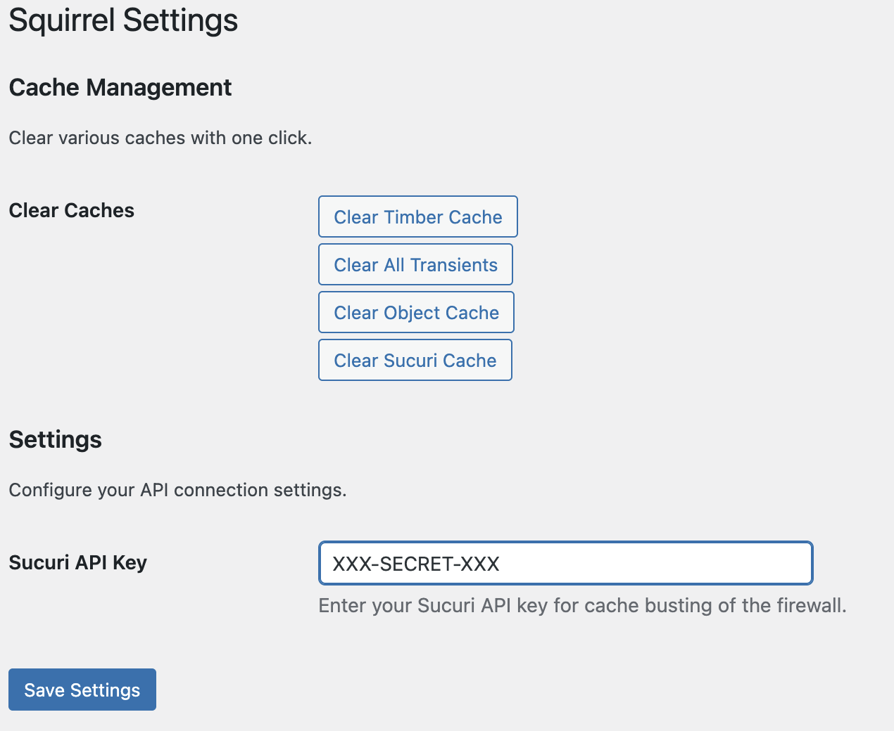

# Squirrel Cache Busting Plugin

## Description

Squirrel is a simple WordPress plugin to help you clear various caches on your site, including support for Sucuri WAF if you have an API key.

## Installation

1. [Download the latest ZIP from GitHub](https://github.com/kindlemanhq/squirrel).
2. In your WordPress admin, go to **Plugins > Add New**.
3. Click **Upload Plugin** and select the ZIP file.
4. Install and activate the plugin.

## Usage

1. Go to **Settings > Squirrel** in your WordPress admin.
2. View and clear available caches with one click.
3. (Optional) Enter your Sucuri API key to enable Sucuri WAF cache busting.

[https://kindlemanhq.github.io/squirrel/](https://kindlemanhq.github.io/squirrel/)

## Credits
This is built by the good Kindlefolk. You can [contact us for help, support, coffee or a whole new site.](https://www.kindleman.com.au/contact/).